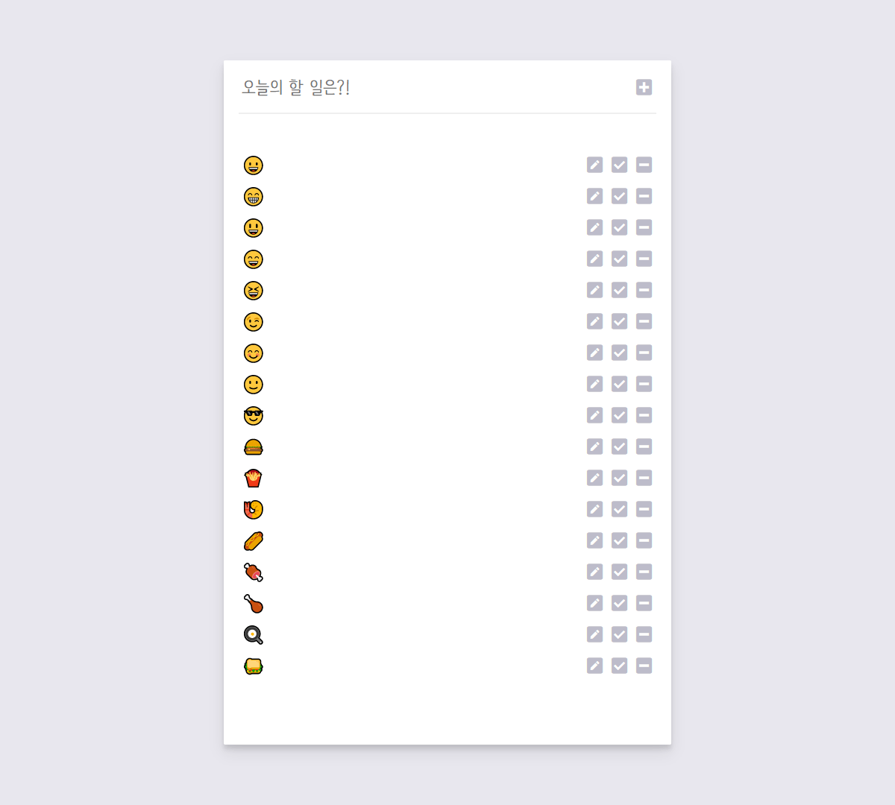

# toDoList

## 설명

- 웹 브라우저를 새로 고침 하거나, 닫았다가 열더라도 작성된 항목들이 초기화 되지 않도록 로컬 스토리지를 이용하여 저장하였습니다.
- 드래그 앤 드롭 기능을 사용하여 작성된 항목의 순서를 마우스로 변경할 수 있도록 하였습니다.
- PC, 태블릿, 모바일등 서로 다른 기기에서도 원활히 이용할 수 있도록 반응형으로 제작하였습니다.
- **[사이트로 이동](https://990225.github.io/toDoList/)**

## 주요 기능

- 로컬 스토리지에 저장
- 드래그 앤 드롭

## 스크린샷

